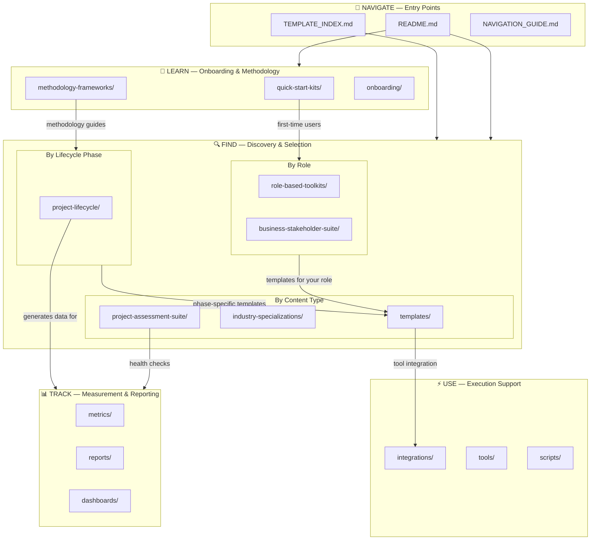

# System Architecture Overview

> How this repository is organized and how to find what you need.

---

## Repository Mental Model

This repository is organized around **three complementary navigation paths** — you can enter from whichever angle matches how you think about your work:

1. **By Role** — *"I'm a Scrum Master, what do I need?"* → Start at [`role-based-toolkits/`](../role-based-toolkits/) to find curated template sets for your role (Project Manager, Scrum Master, Product Owner, Program Manager, or Executive Sponsor). Each toolkit includes essential templates, guidance, and links to deeper resources.

2. **By Lifecycle Phase** — *"I'm in the planning phase, what's available?"* → Start at [`project-lifecycle/`](../project-lifecycle/) to navigate through the five universal project phases: Initiation → Planning → Execution → Monitoring & Control → Closure. Templates are methodology-agnostic and scale from simple to comprehensive.

3. **By Methodology** — *"I'm running an agile project, show me agile templates."* → Start at [`methodology-frameworks/`](../methodology-frameworks/) for framework-specific guidance, or browse [`templates/agile/`](../templates/agile/), [`templates/traditional/`](../templates/traditional/), or [`templates/hybrid/`](../templates/hybrid/) for methodology-specific templates.

These three paths overlap intentionally — a sprint planning template appears in the Scrum Master toolkit, in the Execution phase, and in the agile methodology area. Start with the path that matches your question, and cross-reference as needed.

---

## Architecture Diagram

---

## Zone Descriptions

### 🧭 NAVIGATE — Entry Points
Where you land first. The README, Template Index, and Navigation Guide route you to the right area based on your role, task, or methodology preference.

### 📖 LEARN — Onboarding & Methodology
For new users and methodology selection. Quick-start kits get you productive in under 5 minutes. Methodology frameworks provide deeper guidance on agile, traditional, and hybrid approaches.

### 🔍 FIND — Discovery & Selection
The core of the repository, organized three ways:
- **By Role:** 5 role-based toolkits + executive/stakeholder suite
- **By Lifecycle Phase:** 5 phases from initiation to closure
- **By Content Type:** Template library, industry specializations, assessment suite

### ⚡ USE — Execution Support
Tool integrations (Jira, GitHub, Asana), CLI tools, and automation scripts that help you use templates in your actual workflow.

### 📊 TRACK — Measurement & Reporting
Metrics data, status reports, and dashboards that track project health and delivery progress over time.

---

## Key Directories

| Directory | Purpose | Entry Point For |
|-----------|---------|-----------------|
| `role-based-toolkits/` | Curated template sets by PM role | Role-based navigation |
| `project-lifecycle/` | Templates by project phase (initiation → closure) | Phase-based navigation |
| `methodology-frameworks/` | Agile, traditional, hybrid framework guides | Methodology-based navigation |
| `templates/` | Core template library by methodology | Direct template access |
| `business-stakeholder-suite/` | Executive dashboards, financial governance | Executive/sponsor access |
| `project-assessment-suite/` | Health, maturity, risk, governance assessments | Project evaluation |
| `industry-specializations/` | Healthcare, financial services, IT, construction | Industry-specific needs |
| `quick-start-kits/` | First-time PM, agile transformation, methodology selection | New user onboarding |
| `integrations/` | Tool connectors (Jira, Asana, webhooks) | Tool integration |
| `tools/` | CLI utilities (requirements structuring, template generation) | Automation |
| `metrics/` | Time-series risk and status metrics data | Performance tracking |
| `docs/` | Extended documentation, governance, community guides | Reference |

---

## Future Direction

This repository is undergoing a **Value Delivery System Upgrade (vNext)** that will:
- Reorganize content around 6 **performance domains** (Stakeholder, Team, Delivery, Planning, Uncertainty, Measurement)
- Map every asset to a **value delivery flow** (Inputs → Activities → Outputs → Outcomes)
- Consolidate duplicate directories and eliminate navigation confusion
- Add benefits realization tracking, a template decision engine, and governance modernization

The current structure will be preserved during the transition with backward-compatible paths.
