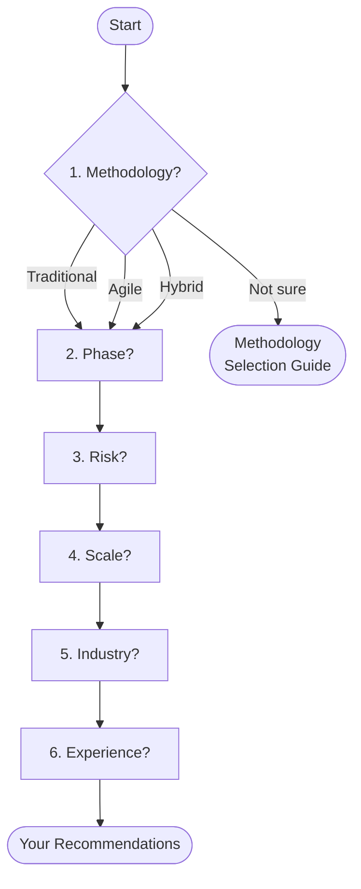

# Template Decision Tree

**Find the right project management templates in 6 quick questions.**

> **Prerequisites:**
> - If you haven't chosen a methodology yet, start with the [Methodology Selection Guide](../../quick-start-kits/methodology-selection-guide.md) first.
> - If you already know what you need, browse the [Template Index](../../TEMPLATE_INDEX.md) or use the [Template Selection Checklist](../../TEMPLATE_SELECTION_CHECKLIST.md).

---

## How It Works

Answer 6 questions about your project. Each answer narrows the recommendations. At the end, you'll receive a tailored template set with links and rationale.

**Questions:** Methodology → Phase → Risk → Scale → Industry → Experience

---

## Question 1: What methodology does your project follow?

*Question 1 of 6*

Choose one:

- **A) Traditional / Waterfall** — Sequential phases, formal gates, comprehensive upfront planning
  → [Continue to Question 2](#question-2-what-phase-is-your-project-in)

- **B) Agile / Scrum** — Iterative sprints, continuous delivery, adaptive planning
  → [Continue to Question 2](#question-2-what-phase-is-your-project-in)

- **C) Hybrid** — Mix of traditional planning with agile execution
  → [Continue to Question 2](#question-2-what-phase-is-your-project-in)

- **D) Not sure** — Need help choosing
  → Go to the [Methodology Selection Guide](../../quick-start-kits/methodology-selection-guide.md), then come back here.

**Record your answer:** ____

---

## Question 2: What phase is your project in?

*Question 2 of 6 · [← Back to Question 1](#question-1-what-methodology-does-your-project-follow)*

Choose one:

- **A) Just starting** — Project initiation, chartering, business case
- **B) Planning** — Defining scope, schedule, budget, resources
- **C) In progress** — Executing and delivering work
- **D) Closing** — Wrapping up, handover, lessons learned

**Record your answer:** ____

→ [Continue to Question 3](#question-3-what-is-your-projects-risk-profile)

---

## Question 3: What is your project's risk profile?

*Question 3 of 6 · [← Back to Question 2](#question-2-what-phase-is-your-project-in)*

Choose one:

- **A) Low** — Minimal risk, no regulatory requirements
- **B) Medium** — Some unknowns, moderate complexity
- **C) High** — Significant risk, mission-critical, multiple dependencies
- **D) Regulatory** — Compliance requirements (FDA, SOX, HIPAA, GDPR, etc.)

**Record your answer:** ____

→ [Continue to Question 4](#question-4-what-is-your-project-scale)

---

## Question 4: What is your project scale?

*Question 4 of 6 · [← Back to Question 3](#question-3-what-is-your-projects-risk-profile)*

Choose one:

- **A) Small** — Solo or small team (1–9 people), under 3 months
- **B) Medium** — Mid-size team (10–50 people), 3–12 months
- **C) Large** — Large team (50+ people), 1+ years, multiple workstreams

**Record your answer:** ____

→ [Continue to Question 5](#question-5-what-industry-is-your-project-in)

---

## Question 5: What industry is your project in?

*Question 5 of 6 · [← Back to Question 4](#question-4-what-is-your-project-scale)*

Choose one:

- **A) General / Other** — No industry-specific requirements
- **B) IT / Software** — Technology, software development, digital transformation
- **C) Healthcare / Pharmaceutical** — Clinical, regulatory, GxP requirements
- **D) Financial Services** — Banking, insurance, compliance-heavy

**Record your answer:** ____

→ [Continue to Question 6](#question-6-what-is-your-pm-experience-level)

---

## Question 6: What is your PM experience level?

*Question 6 of 6 · [← Back to Question 5](#question-5-what-industry-is-your-project-in)*

Choose one:

- **A) New to PM** — First project or limited experience
- **B) Intermediate** — Several projects completed
- **C) Advanced** — Senior PM, certified, extensive experience

**Record your answer:** ____

→ [Find your recommendations below](#your-recommendations)

---

## Your Recommendations

Use your answers to find the matching recommendation set below. Start with your **methodology** (Q1), then refine by **risk + scale** (Q3 + Q4).

### Traditional / Waterfall Projects

#### Small Traditional Project (Low/Medium Risk)
*Answers: Traditional + Any Phase + Low or Medium Risk + Small + Any Industry + Any Experience*

**Start with these:**
1. [Project Charter Template](../../templates/traditional/Traditional/Process_Groups/Initiating/project_charter_template.md)
2. [Stakeholder Register Template](../../project-lifecycle/01-initiation/stakeholder-analysis/stakeholder-register-template.md)
3. [Communication Plan Template](../../templates/traditional/Traditional/Templates/communication_plan_template.md)

**If medium risk, also add:**
4. [Risk Register Template](../../project-lifecycle/02-planning/risk-management/risk-register-template.md)

**Recommended toolkit:** [Quick Start Kits](../../quick-start-kits/) · [First-Time PM Starter](../../quick-start-kits/first-time-pm-starter/) (if new to PM)

**Why these?** Minimum viable traditional PM setup. Charter and stakeholder register are non-negotiable for formal projects, even small ones. Keeping the set small avoids documentation overhead on short projects.

---

#### Standard Traditional Project (Medium Risk, Medium Scale)
*Answers: Traditional + Planning + Medium Risk + Medium + Any Industry + Intermediate or Advanced*

**Start with these:**
1. [Project Management Plan Template](../../templates/traditional/Traditional/Process_Groups/Planning/project_management_plan_template.md)
2. [Work Breakdown Structure Template](../../templates/traditional/Traditional/Process_Groups/Planning/work_breakdown_structure_template.md)
3. [Project Schedule Template](../../templates/traditional/Traditional/Process_Groups/Planning/project_schedule_template.md)
4. [Risk Register Template](../../project-lifecycle/02-planning/risk-management/risk-register-template.md)
5. [Risk Management Plan Template](../../project-lifecycle/02-planning/risk-management/risk-management-plan-template.md)
6. [Resource Management Plan Template](../../project-lifecycle/02-planning/resource-planning/resource-management-plan-template.md)
7. [Budget Template](../../role-based-toolkits/project-manager/essential-templates/budget-template.md)

**Recommended toolkit:** [Role-Based Toolkits — Project Manager](../../role-based-toolkits/project-manager/)

**Why these?** Full PMBOK planning suite with moderate risk management. These establish baselines for scope, schedule, cost, and risk.

---

#### Enterprise Traditional Program (High/Regulatory Risk, Large Scale)
*Answers: Traditional + Any Phase + High or Regulatory + Large + Any Industry + Advanced*

**Start with these (all Standard templates above, plus):**
8. [Program Management Plan Template](../../templates/traditional/Traditional/Templates/program_management_plan_template.md)
9. [Change Management Plan Template](../../templates/traditional/Traditional/Templates/change_management_plan_template.md)
10. [Enterprise Risk Assessment Template](../../project-lifecycle/02-planning/risk-management/enterprise-risk-assessment-template.md)
11. [Governance Assessment Template](../../project-assessment-suite/governance-assessment-template.md)
12. [Executive Dashboard Template](../../business-stakeholder-suite/executive-dashboards/powerbi-integration/executive-dashboard-template.md)
13. [ROI Tracking Template](../../templates/traditional/Traditional/Knowledge_Areas/Project_Cost_Management/roi_tracking_template.md)

**If regulatory, also add compliance templates for your industry:**
- Healthcare: [Compliance Risk Assessment](../../industry-specializations/healthcare-pharmaceutical/regulatory/compliance_risk_assessment_template.md), [Validation Master Plan](../../industry-specializations/healthcare-pharmaceutical/validation/validation_master_plan_template.md), [GxP Training Plan](../../industry-specializations/healthcare-pharmaceutical/compliance/gxp_training_plan_template.md)
- Financial: [Compliance Management](../../industry-specializations/financial-services/compliance/compliance-management-template.md), [EVM Dashboard](../../business-stakeholder-suite/financial-governance/enhanced-business-cases/evm-dashboard-template.md)
- IT: [Cybersecurity Assessment](../../industry-specializations/information-technology/security/cybersecurity_assessment_template.md), [Test Plan](../../industry-specializations/information-technology/software-development/test_plan_template.md)

**Recommended toolkit:** [Role-Based Toolkits](../../role-based-toolkits/) + [Business Stakeholder Suite](../../business-stakeholder-suite/)

**Why these?** Maximum governance for regulated enterprise programs. Program management, executive reporting, and compliance templates ensure audit readiness and multi-level oversight.

---

### Agile / Scrum Projects

#### Small Agile Project (Low Risk)
*Answers: Agile + Any Phase + Low Risk + Small + Any Industry + Any Experience*

**Start with these:**
1. [Agile Team Charter Template](../../project-lifecycle/01-initiation/project-charter/agile-team-charter-template.md)
2. [Product Backlog Template](../../templates/agile/product_backlog_template.md)
3. [Sprint Planning Template](../../templates/agile/sprint_planning_template.md)

**Recommended toolkit:** [Quick Start Kits](../../quick-start-kits/) · [First-Time PM Starter](../../quick-start-kits/first-time-pm-starter/) (if new to PM)

**Why these?** Minimal process overhead for small agile teams. These three artifacts — charter, backlog, and sprint planning — are the essential Scrum foundation.

---

#### Standard Agile Project (Medium Risk, Medium Scale)
*Answers: Agile + Any Phase + Medium Risk + Medium + Any Industry + Intermediate or Advanced*

**Start with these:**
1. [Product Backlog Template](../../templates/agile/product_backlog_template.md)
2. [Sprint Planning Template](../../templates/agile/sprint_planning_template.md)
3. [Sprint Review Template](../../templates/agile/sprint_review_template.md)
4. [Sprint Retrospective Template](../../templates/agile/sprint_retrospective_template.md)
5. [Agile Release Plan Template](../../project-lifecycle/02-planning/project-management-plan/agile-release-plan-template.md)
6. [Risk Register Template](../../project-lifecycle/02-planning/risk-management/risk-register-template.md)

**If IT industry, also add:**
7. [Requirements Specification Template](../../industry-specializations/information-technology/software-development/requirements_specification_template.md)
8. [Test Plan Template](../../industry-specializations/information-technology/software-development/test_plan_template.md)

**Recommended toolkit:** [Role-Based Toolkits](../../role-based-toolkits/) (Scrum Master or Product Owner)

**Why these?** Full Scrum ceremony suite with release planning and moderate risk tracking. The four ceremony templates (planning, review, retro + backlog) form the agile heartbeat.

---

#### Scaled Agile Project (High Risk, Large Scale)
*Answers: Agile + Any Phase + High or Regulatory + Large + Any Industry + Advanced*

**Start with these (all Standard Agile templates above, plus):**
7. [Daily Standup Template](../../role-based-toolkits/scrum-master/agile-ceremonies/daily-standup-template.md)
8. [Backlog Refinement Template](../../role-based-toolkits/scrum-master/agile-ceremonies/backlog-refinement-template.md)
9. [SAFe Program Increment Planning Template](../../methodology-frameworks/agile-scrum/scaling-frameworks/safe/safe_program_increment_planning_template.md)
10. [Enterprise Risk Assessment Template](../../project-lifecycle/02-planning/risk-management/enterprise-risk-assessment-template.md)
11. [Governance Assessment Template](../../project-assessment-suite/governance-assessment-template.md)
12. [Executive Dashboard Template](../../business-stakeholder-suite/executive-dashboards/powerbi-integration/executive-dashboard-template.md)

**If regulatory, also add compliance templates for your industry** (see [Enterprise Traditional](#enterprise-traditional-program-highregulatory-risk-large-scale) for industry-specific lists).

**Recommended toolkit:** [Role-Based Toolkits](../../role-based-toolkits/) + [Business Stakeholder Suite](../../business-stakeholder-suite/) + [SAFe/LeSS Scaling Frameworks](../../methodology-frameworks/agile-scrum/scaling-frameworks/)

**Why these?** Full agile ceremony suite plus scaling frameworks for multi-team coordination. High-risk supplements add governance, risk assessment, and executive visibility.

---

### Hybrid Projects

#### Balanced Hybrid Project (Medium Risk, Medium Scale)
*Answers: Hybrid + Any Phase + Low or Medium Risk + Small or Medium + Any Industry + Any Experience*

**Start with these:**
1. [Hybrid Quality Management Template](../../templates/hybrid/Hybrid/Templates/hybrid_quality_management_template.md)
2. [Integrated Change Strategy Template](../../templates/hybrid/Hybrid/Templates/integrated_change_strategy_template.md)
3. [Hybrid Team Management Template](../../templates/hybrid/Hybrid/Templates/hybrid_team_management_template.md)
4. [Status Report Template](../../project-lifecycle/04-monitoring-control/progress-tracking/status-report-template.md)
5. [Project Dashboard Template](../../project-lifecycle/04-monitoring-control/progress-tracking/project-dashboard-template.md)

**If medium risk, also add:**
6. [Risk Register Template](../../project-lifecycle/02-planning/risk-management/risk-register-template.md)

**If financial industry, also add:**
7. [Compliance Management Template](../../industry-specializations/financial-services/compliance/compliance-management-template.md)
8. [EVM Dashboard Template](../../business-stakeholder-suite/financial-governance/enhanced-business-cases/evm-dashboard-template.md)

**Recommended toolkit:** [Role-Based Toolkits](../../role-based-toolkits/)

**Why these?** Hybrid templates bridge traditional governance with agile execution flexibility. The integrated change strategy is key — it defines how traditional and agile components interact.

---

#### Governed Hybrid Program (High Risk, Large Scale)
*Answers: Hybrid + Any Phase + High or Regulatory + Large + Any Industry + Advanced*

**Start with these (all Balanced Hybrid templates above, plus):**
6. [Hybrid Project Charter Template](../../templates/hybrid/Hybrid/Templates/hybrid_project_charter_template.md)
7. [Hybrid Release Planning Template](../../templates/hybrid/Hybrid/Templates/hybrid_release_planning_template.md)
8. [Progressive Acceptance Plan Template](../../templates/hybrid/Hybrid/Templates/progressive_acceptance_plan_template.md)
9. [Hybrid Infrastructure Template](../../methodology-frameworks/hybrid/infrastructure/hybrid-infrastructure-template.md)
10. [Enterprise Risk Assessment Template](../../project-lifecycle/02-planning/risk-management/enterprise-risk-assessment-template.md)
11. [Governance Assessment Template](../../project-assessment-suite/governance-assessment-template.md)
12. [Project Health Assessment Template](../../project-assessment-suite/project-health-assessment-template.md)
13. [Executive Dashboard Template](../../business-stakeholder-suite/executive-dashboards/powerbi-integration/executive-dashboard-template.md)
14. [Budget Dashboard Template](../../business-stakeholder-suite/financial-governance/budget-dashboard-template.md)

**If regulatory, also add compliance templates for your industry** (see [Enterprise Traditional](#enterprise-traditional-program-highregulatory-risk-large-scale) for industry-specific lists).

**Recommended toolkit:** [Role-Based Toolkits](../../role-based-toolkits/) + [Business Stakeholder Suite](../../business-stakeholder-suite/)

**Why these?** Full hybrid template set with enterprise governance. The progressive acceptance plan is unique to hybrid — it bridges traditional formal acceptance with agile incremental delivery.

---

## Phase-Specific Additions

Regardless of methodology, add these templates based on your **current phase** (Q2):

| Phase | Add These Templates |
|-------|-------------------|
| **Just starting** | [Stakeholder Register](../../project-lifecycle/01-initiation/stakeholder-analysis/stakeholder-register-template.md), [Business Case Template](../../templates/traditional/Traditional/Templates/business_case_template.md) |
| **Planning** | [Skills Matrix](../../project-lifecycle/02-planning/resource-planning/skills-matrix-template.md), [Team Charter](../../project-lifecycle/02-planning/resource-planning/team-charter-template.md) |
| **In progress** | [Issue Log](../../templates/traditional/Traditional/Templates/issue_log_template.md), [Change Request Template](../../templates/traditional/Traditional/Templates/change_request_template.md) |
| **Closing** | [Project Closure Report](../../templates/traditional/Traditional/Process_Groups/Closing/project_closure_report_template.md), [Handover Template](../../role-based-toolkits/project-manager/essential-templates/handover-template.md) |

---

## Experience-Level Adjustments

Based on your **PM experience** (Q6):

- **New to PM:** Start with the [First-Time PM Starter Kit](../../quick-start-kits/first-time-pm-starter/) and the [Template Customization Guide](../../quick-start-kits/template-customization-guide.md). Use the simplified versions of templates when available.
- **Intermediate:** Use the standard methodology-specific templates. Add the [Project Assessment Suite](../../project-assessment-suite/) for periodic health checks.
- **Advanced:** Use the full template set with comprehensive governance. Consider the [Process Maturity Assessment](../../project-assessment-suite/process-maturity-assessment-template.md) to optimize your approach.

---

## Path Traceability

Every recommendation in this decision tree is backed by the [Rules Engine](../../meta/architecture-research/806-rules-engine-implementation.md). If you want to understand why a specific template was recommended (or not), look up the rule IDs in the rules engine document.

For the complete technical design of this decision tree, see the [Decision Tree Design](../../meta/architecture-research/809-decision-tree-design.md) in the architecture research docs.

---

## Related Resources

- [Methodology Selection Guide](../../quick-start-kits/methodology-selection-guide.md) — Choose a methodology before selecting templates
- [Template Selection Checklist](../../TEMPLATE_SELECTION_CHECKLIST.md) — Quick checklist for experienced PMs
- [Template Index](../../TEMPLATE_INDEX.md) — Browse all 137+ templates
- [30-Day Quick Start](../../quick-start-kits/30-day-quick-start.md) — Step-by-step onboarding plan
