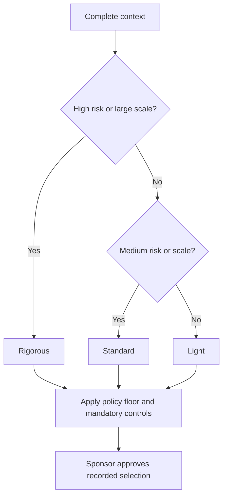

# Adaptive Governance Model and Decision Matrix

Story #746 · Parent #713 · Sprint 14

Select **Light**, **Standard**, or **Rigorous** governance using the project's context. These are minimum controls, not assessments of compliance or permission to proceed. The sponsor approves the selection and names each authority before work is authorized.

Use this model to make oversight proportional to project scale and exposure. Do not use it to waive fixed organizational, contractual, or regulatory controls. Mandatory controls take precedence at every tier; the responsible control owner confirms applicability. An industry label alone neither establishes nor excludes an obligation.

## Select a tier

Use the seven fields in the [decision-engine context model](../../meta/architecture-research/800-801-context-assessment-model.md). Apply all rows and take the **highest** applicable tier, then apply the organization's minimum. Do not average risks or let a small team offset high risk.

| Context field | Light floor | Standard floor | Rigorous floor |
|---|---|---|---|
| `risk_profile` | `low` | `medium` | `high`, `regulatory` |
| `size` | `small` | `medium` | `large`, `enterprise` |
| `team_size` | `solo`, `small` | `medium` | `large` |

Light therefore requires low risk, small project size, and a solo or small team. Standard applies when at least one Standard condition holds and no Rigorous condition holds. Any Rigorous condition wins. If a field is missing or invalid, complete the assessment before selecting a tier; keep existing controls meanwhile.

| Remaining context field | How to tailor without lowering the tier |
|---|---|
| `methodology` | `traditional`: phase gates; `agile`: release/increment gates may share ceremonies if evidence and approvers match; `hybrid`: align both; `unsure`: resolve method with the sponsor while retaining the selected controls. |
| `industry` | `general`, `it`, `healthcare`, `financial`, `construction`: ask the accountable control owner which domain controls apply. Record confirmed obligations and add them to the baseline. |
| `phase` | `starting`: approve authority; `planning`: approve baseline; `in_progress`: maintain evidence and review changes; `closing`: accept outcomes, transfer obligations and archive decisions. Joining mid-project requires a gap review, not retrospective approvals. |
| `pm_experience` | `new`: provide coaching and simpler forms; `intermediate`: standard instructions; `advanced`: allow efficient tooling. Experience never removes evidence or approval requirements. |



Here, high risk includes `regulatory`; large scale includes `size=enterprise` or `team_size=large`. Medium scale includes `size=medium` or `team_size=medium`.

### Reproducible selection

The [reference selector](../../scripts/select_governance_tier.py) accepts the existing v1 profile format; it does not change the context schema or the template-generator CLI. It returns a recommendation with reasons, not an approval. Additional profile fields are ignored; every required context field is validated.

```json
{
  "profile_version": "1.0",
  "project_context": {
    "size": "small",
    "methodology": "agile",
    "risk_profile": "low",
    "team_size": "small",
    "industry": "it",
    "phase": "starting",
    "pm_experience": "new"
  }
}
```

Save that profile as `context.json`, then run from the repository root:

```sh
python scripts/select_governance_tier.py context.json
python scripts/select_governance_tier.py context.json --minimum-tier standard
```

The first command selects Light; the second selects Standard. The policy floor is a separate input because it is not a context-model field. Set it from the organization's approved policy, not personal preference. Invalid input exits with status 2 and produces no recommendation.

## Required controls by tier

Artifacts are evidence requirements: combine them in one maintained record for Light, link existing tools for other tiers, and avoid duplicate data entry. Every approval records the decision, approver, date, evidence and conditions. A meeting or completed form alone is not approval.

| Tier | Required artifacts | Review gates | Approval authorities | Reporting cadence |
|---|---|---|---|---|
| **Light** | Short governance charter with tier rationale, scope and tolerances; named roles and decision rights; combined risk, issue, change and decision log; acceptance evidence and closure record. | Sponsor authorization before work; acceptance before release/handover; closure review; approval before exceeding an agreed tolerance. | Sponsor approves charter, baseline, exceptions and closure; PM decides within written delegation; named recipient accepts deliverables. No self-approval of reserved sponsor decisions. | PM updates the combined record weekly; sponsor reviews status at least monthly and before each gate. Escalate tolerance breaches promptly. |
| **Standard** | All Light evidence, plus governance framework, explicit authority/escalation matrix, maintained risk register, change impact/approval records, gate checklist and status report. | Initiation authorization, planning baseline, each phase/release readiness, and closure; material changes require impact review before commitment. | Sponsor approves baseline and closure; sponsor-designated steering/change authority approves changes within its mandate; PM handles delegated decisions; delivery owner accepts outcomes. | Weekly team status/risk review; sponsor or steering review at least fortnightly; gate and exception reporting as needed. |
| **Rigorous** | All Standard evidence, plus formal governance charter, steering/change board mandates, assurance plan and review evidence, obligation/control register with owners, traceable approvals and retained audit evidence. Add program coordination/benefit records when governing a program. | Formal authorization, baseline, phase/release readiness and closure; independent assurance at relevant gates; control owners approve applicable control evidence before release. Unmet mandatory conditions block approval. | Executive sponsor/steering authority approves funding and baselines; authorized change board decides material changes; independent assurance/control owners sign their areas; PM cannot waive reserved decisions. | Weekly formal status, risk and control report; steering review at least fortnightly; control-owner/assurance review at each applicable gate. Escalate material breaches immediately under the agreed escalation route. |

Record stricter required cadences in the charter. Gate reviews supplement scheduled reviews. Time-critical decisions must follow the named escalation authority rather than waiting for the next meeting. Light projects can satisfy authorization and planning in one recorded sponsor review; they still need acceptance and closure evidence.

## Existing templates and tier tags

Visible **Governance tiers** tags identify applicability, not a requirement to complete every template. Use the required evidence above to choose the smallest sufficient set. The [tier inventory](../../meta/governance-tiers.json) records the existing project/program governance assets and assessment; industry overlays and repository-maintenance checklists have separate purposes.

| Purpose | Existing asset | Applicable tiers / tailoring |
|---|---|---|
| Establish authority | [Project governance charter](../../role-based-toolkits/project-manager/governance-tools/governance-charter.md) | All: short combined charter for Light; explicit board/assurance mandates for Rigorous. |
| Operating controls | [Governance framework](../../role-based-toolkits/project-manager/governance-tools/governance-framework.md) | All: use only sections needed for tier evidence; sample committee structures are not mandatory for Light. |
| Decision and escalation rights | [Decision authority](../../role-based-toolkits/project-manager/governance-tools/decision-authority.md), [roles](../../role-based-toolkits/project-manager/governance-tools/governance-roles.md), [decision framework](../../role-based-toolkits/project-manager/governance-tools/decision-framework.md), [escalation matrix](../../role-based-toolkits/project-manager/governance-tools/escalation-matrix.md) | All: name people, delegated limits and the next authority; combine for Light. |
| Changes and gates | [Change control](../../role-based-toolkits/project-manager/governance-tools/change-control-process.md), [quality gates](../../role-based-toolkits/project-manager/governance-tools/quality-gates.md) | All: a logged sponsor decision can satisfy a Light change gate; Standard/Rigorous retain impact and review evidence. |
| Program authority | [Program charter](../../role-based-toolkits/program-manager/governance-framework/governance-charter.md), [authority matrix](../../role-based-toolkits/program-manager/governance-framework/decision-authority-matrix.md), [steering charter](../../role-based-toolkits/program-manager/governance-framework/steering-committee-charter.md), [change board charter](../../role-based-toolkits/program-manager/governance-framework/change-control-board-charter.md) | Standard, Rigorous: use when program coordination requires these authorities. |
| Program assurance and benefits | [Quality plan](../../role-based-toolkits/program-manager/governance-framework/program-quality-management-plan.md), [benefits governance](../../role-based-toolkits/program-manager/benefits-realization/benefits-governance.md), [portfolio cadence](../../role-based-toolkits/program-manager/portfolio-management/governance-cadence.md) | Standard, Rigorous: align program oversight with project reporting; portfolio cadence does not replace project gates. |
| Check proportionality | [Governance assessment](../../domains/measurement/project-assessment-suite/governance-assessment-template.md) | All: review evidence and gaps at selection and when context changes; assessment scores do not override the tier floor. |

Some existing assets are outlines. Use this model's required controls to complete their sections; an empty outline does not satisfy a gate. Sample dates, cadences and committee structures in templates must be tailored to the approved charter, with mandatory controls retained.

## Changing tiers

Reassess at each scheduled governance review and before a material change in risk, scope, team, obligations or organizational policy. Phase progression and PM experience alone do not justify a downgrade.

1. **Record the change:** PM captures old/new context, supporting evidence, selector result, policy floor and affected controls in the decision log.
2. **Moving up:** apply the higher tier as the interim baseline immediately. Notify the sponsor and control owners; identify missing artifacts, owners and due dates before further affected commitments. Pause any affected gate until its required evidence and authority are in place. Carry forward all existing obligations and decisions.
3. **Moving down:** keep current controls until the sponsor and affected control owners approve. Demonstrate the lower context conditions, resolved/accepted residual risks and continued mandatory control coverage. A lower selector result alone is insufficient. Approval cannot lower the context or policy floor.
4. **Activate and follow up:** update the charter, authority matrix, cadence and evidence locations; notify the team; retain the previous baseline and approval history. Check effectiveness at the next scheduled review.

| Transition record field | Required content |
|---|---|
| Identity | Project, date, PM and current charter version |
| Before / after | Seven context fields, previous tier, recommended tier and policy floor |
| Evidence and controls | Reason, supporting links, mandatory controls retained, gaps and interim restrictions |
| Authorization | Sponsor and affected control-owner decisions, conditions and effective date |
| Implementation | Artifact/control owners, due dates, communication and next review |

## Worked contexts

These are illustrative inputs, not verified organizational assessments. Assume a Light policy floor unless stated; use the full seven-field profile in practice.

| Context | `size` / `risk_profile` / `team_size` | Other tailoring | Tier and reason |
|---|---|---|---|
| Small internal improvement | small / low / solo | traditional, general, starting, new | **Light**; use a combined charter/log and sponsor gates. Coaching does not change the floor. |
| Startup SaaS with high technical exposure | medium / high / small | agile, it, planning, intermediate | **Rigorous**; high risk wins despite the small team. Align assurance gates with releases. |
| Enterprise bank program with confirmed obligations | enterprise / regulatory / large | hybrid, financial, in_progress, advanced | **Rigorous**; all three dimensions require it. Control owners confirm applicable evidence. |
| Healthcare implementation with confirmed obligations | medium / regulatory / medium | traditional, healthcare, planning, intermediate | **Rigorous**; regulatory risk takes precedence over medium scale. |
| Digital agency delivery | medium / medium / medium | agile, general, in_progress, advanced | **Standard**; use scheduled reviews plus change escalation and release gates. |
| Internal IT service change | small / low / medium | hybrid, it, closing, advanced | **Standard**; team coordination requires it even during closure. |

## Related governance work

This reconciles the tier selection part of the existing #749 guide with #746. The former four-tier vocabulary and uncalibrated percentage scores are superseded here; reassess legacy selections from context rather than mechanically renaming them.

Risk-based scaling (#747) will refine artifacts and review intensity within this baseline. Event-driven controls (#748) will define additional triggers and response ownership; they supplement scheduled reviews and cannot remove baseline gates. Those stories remain separate work. The [compliance integration framework](compliance-integration-framework.md) is a supporting reference; the accountable control owner determines the actual mandatory controls.
