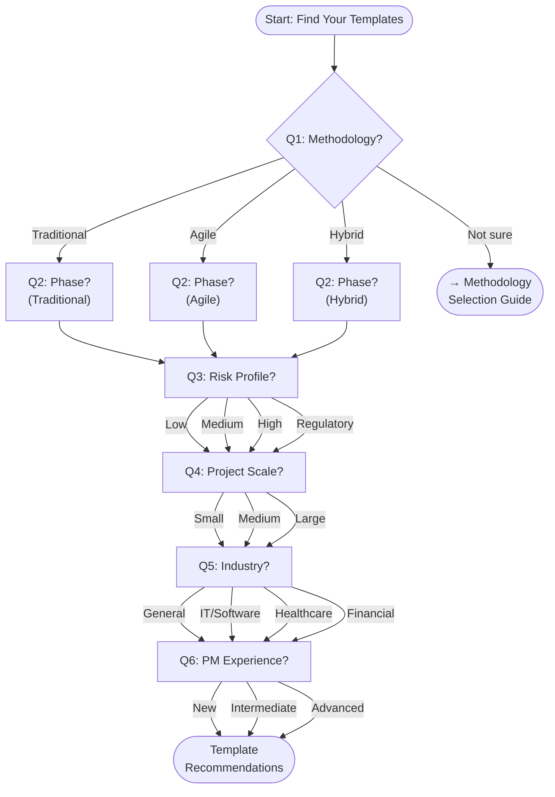

# Task #809: Decision Tree Design

**Story:** #728 ([Selection] – Decision Tree Guide)
**Epic:** #709 (Epic 2: Template Decision Engine)
**Date:** 2026-05-31
**Status:** Complete
**Closes:** #809

---

## Overview

This document defines the decision tree node map, branching logic, and terminal node recommendations for the Template Decision Engine. It implements the 6-question guided flow designed in [808-decision-tree-research.md](808-decision-tree-research.md), backed by the rules engine in [806-rules-engine-implementation.md](806-rules-engine-implementation.md).

**Design constraints:**
- Pure markdown, no tooling required — works as plain GitHub-rendered docs
- 6 questions, each with 2–4 options
- Every terminal node shows: recommended templates, rationale, and supporting rule IDs
- All paths are traceable — users can reconstruct why they received a recommendation

> *If you haven't selected a methodology yet, start with the [Methodology Selection Guide](../../quick-start-kits/methodology-selection-guide.md) first, then return here.*
>
> *Already know what you need? Skip to the [Template Selection Checklist](../../TEMPLATE_SELECTION_CHECKLIST.md) or browse the [Template Index](../../TEMPLATE_INDEX.md).*

---

## Decision Tree Node Map (Mermaid)

---

## Node Definitions

### Q1: What methodology does your project follow?
*Question 1 of 6*

| Option | Description | Next Step | Rules Activated |
|--------|-------------|-----------|-----------------|
| **Traditional / Waterfall** | Sequential phases, formal gates, comprehensive upfront planning | [→ Q2](#q2-what-phase-is-your-project-in) | R001 |
| **Agile / Scrum** | Iterative sprints, continuous delivery, adaptive planning | [→ Q2](#q2-what-phase-is-your-project-in) | R002 |
| **Hybrid** | Mix of traditional planning with agile execution | [→ Q2](#q2-what-phase-is-your-project-in) | R003 |
| **Not sure** | Need help choosing a methodology | [→ Methodology Selection Guide](../../quick-start-kits/methodology-selection-guide.md) | — |

### Q2: What phase is your project in?
*Question 2 of 6 · [← Back to Q1](#q1-what-methodology-does-your-project-follow)*

| Option | Description | Next Step | Rules Activated |
|--------|-------------|-----------|-----------------|
| **Just starting** | Project initiation, chartering, business case | [→ Q3](#q3-what-is-your-projects-risk-profile) | R004 |
| **Planning** | Defining scope, schedule, budget, resources | [→ Q3](#q3-what-is-your-projects-risk-profile) | R005 |
| **In progress** | Executing and delivering work | [→ Q3](#q3-what-is-your-projects-risk-profile) | R006 |
| **Closing** | Wrapping up, handover, lessons learned | [→ Q3](#q3-what-is-your-projects-risk-profile) | R007 |

### Q3: What is your project's risk profile?
*Question 3 of 6 · [← Back to Q2](#q2-what-phase-is-your-project-in)*

| Option | Description | Next Step | Rules Activated |
|--------|-------------|-----------|-----------------|
| **Low** | Minimal risk, no regulatory requirements | [→ Q4](#q4-what-is-your-project-scale) | R011 |
| **Medium** | Some unknowns, moderate complexity | [→ Q4](#q4-what-is-your-project-scale) | R008 |
| **High** | Significant risk, mission-critical | [→ Q4](#q4-what-is-your-project-scale) | R009 |
| **Regulatory** | Compliance requirements (FDA, SOX, HIPAA, GDPR) | [→ Q4](#q4-what-is-your-project-scale) | R010 |

### Q4: What is your project scale?
*Question 4 of 6 · [← Back to Q3](#q3-what-is-your-projects-risk-profile)*

| Option | Description | Next Step | Rules Activated |
|--------|-------------|-----------|-----------------|
| **Small** | Solo or small team (1–9), under 3 months | [→ Q5](#q5-what-industry-is-your-project-in) | R016 + R020 |
| **Medium** | Mid-size team (10–50), 3–12 months | [→ Q5](#q5-what-industry-is-your-project-in) | R017 + R021 |
| **Large** | Large team (50+), 1+ years, multiple workstreams | [→ Q5](#q5-what-industry-is-your-project-in) | R018/R019 + R022 |

### Q5: What industry is your project in?
*Question 5 of 6 · [← Back to Q4](#q4-what-is-your-project-scale)*

| Option | Description | Next Step | Rules Activated |
|--------|-------------|-----------|-----------------|
| **General / Other** | No industry-specific requirements | [→ Q6](#q6-what-is-your-pm-experience-level) | R015 |
| **IT / Software** | Technology, software development | [→ Q6](#q6-what-is-your-pm-experience-level) | R012 |
| **Healthcare / Pharma** | Clinical, regulatory, GxP requirements | [→ Q6](#q6-what-is-your-pm-experience-level) | R013 |
| **Financial Services** | Banking, insurance, compliance-heavy | [→ Q6](#q6-what-is-your-pm-experience-level) | R014 |

### Q6: What is your PM experience level?
*Question 6 of 6 · [← Back to Q5](#q5-what-industry-is-your-project-in)*

| Option | Description | Next Step | Rules Activated |
|--------|-------------|-----------|-----------------|
| **New to PM** | First project or limited experience | [→ Your Recommendations](#terminal-nodes) | R023 |
| **Intermediate** | Several projects completed | [→ Your Recommendations](#terminal-nodes) | R024 |
| **Advanced** | Senior PM, certified, extensive experience | [→ Your Recommendations](#terminal-nodes) | R025 |

---

## Terminal Nodes

After answering all 6 questions, combine the activated rules to generate a recommendation. Below are the 8 key archetypes that cover the most common paths. Paths not listed follow the same pattern — apply the activated rules from each answer using the [Rules Engine](806-rules-engine-implementation.md).

### T1: Lightweight Agile (Small/Low Risk)
**Path:** Agile → Any Phase → Low Risk → Small → General → New PM
**Rules:** R002 + R004–R007 + R011 + R016 + R020 + R023

**Essential Templates (3–5):**
- [Agile Team Charter Template](../../project-lifecycle/01-initiation/project-charter/agile-team-charter-template.md) — Lightweight team alignment
- [Product Backlog Template](../../templates/agile/product_backlog_template.md) — Core agile artifact
- [Sprint Planning Template](../../templates/agile/sprint_planning_template.md) — Sprint-level planning

**Recommended Toolkit:** [Quick Start Kits](../../quick-start-kits/) + [First-Time PM Starter](../../quick-start-kits/first-time-pm-starter/)

**Rationale:** Minimal process overhead for small agile teams. Starter-level templates keep things simple for new PMs. No risk or governance supplements needed.

### T2: Standard Agile (Medium/Medium Risk)
**Path:** Agile → Planning → Medium Risk → Medium → IT → Intermediate
**Rules:** R002 + R005 + R008 + R017 + R021 + R012 + R024

**Essential Templates (7–10):**
- [Product Backlog Template](../../templates/agile/product_backlog_template.md) — Backlog management
- [Sprint Planning Template](../../templates/agile/sprint_planning_template.md) — Sprint planning
- [Sprint Review Template](../../templates/agile/sprint_review_template.md) — Stakeholder feedback
- [Sprint Retrospective Template](../../templates/agile/sprint_retrospective_template.md) — Continuous improvement
- [Agile Release Plan Template](../../project-lifecycle/02-planning/project-management-plan/agile-release-plan-template.md) — Release coordination
- [Risk Register Template](../../project-lifecycle/02-planning/risk-management/risk-register-template.md) — Risk tracking (R008)
- [Requirements Specification Template](../../industry-specializations/information-technology/software-development/requirements_specification_template.md) — IT supplement (R012)

**Recommended Toolkit:** [Role-Based Toolkits](../../role-based-toolkits/) (Scrum Master or Product Owner)

**Rationale:** Standard agile ceremony templates with moderate risk tracking. IT industry supplement adds requirements and test planning. Intermediate complexity is appropriate.

### T3: Scaled Agile (Large/High Risk)
**Path:** Agile → In Progress → High Risk → Large → IT → Advanced
**Rules:** R002 + R006 + R009 + R018 + R022 + R012 + R025

**Essential Templates (12–18):**
- All T2 essential templates, plus:
- [Daily Standup Template](../../role-based-toolkits/scrum-master/agile-ceremonies/daily-standup-template.md) — Daily coordination
- [Backlog Refinement Template](../../role-based-toolkits/scrum-master/agile-ceremonies/backlog-refinement-template.md) — Ongoing backlog grooming
- [SAFe Program Increment Planning Template](../../methodology-frameworks/agile-scrum/scaling-frameworks/safe/safe_program_increment_planning_template.md) — Multi-team planning
- [Enterprise Risk Assessment Template](../../project-lifecycle/02-planning/risk-management/enterprise-risk-assessment-template.md) — Risk governance (R009)
- [Governance Assessment Template](../../project-assessment-suite/governance-assessment-template.md) — Governance (R009)
- [Executive Dashboard Template](../../business-stakeholder-suite/executive-dashboards/powerbi-integration/executive-dashboard-template.md) — Executive reporting (R018)
- [Technical Design Document Template](../../industry-specializations/information-technology/software-development/technical_design_document_template.md) — IT supplement (R012)

**Recommended Toolkit:** [Role-Based Toolkits](../../role-based-toolkits/) + [Business Stakeholder Suite](../../business-stakeholder-suite/) + [SAFe/LeSS Scaling Frameworks](../../methodology-frameworks/agile-scrum/scaling-frameworks/)

**Rationale:** Full agile ceremony suite with scaling frameworks for large teams. High risk triggers governance and risk assessment supplements. Enterprise-level reporting for executive visibility.

### T4: Lightweight Traditional (Small/Low Risk)
**Path:** Traditional → Starting → Low Risk → Small → General → New PM
**Rules:** R001 + R004 + R011 + R016 + R020 + R023

**Essential Templates (3–5):**
- [Project Charter Template](../../templates/traditional/Traditional/Process_Groups/Initiating/project_charter_template.md) — Project authorization
- [Stakeholder Register Template](../../project-lifecycle/01-initiation/stakeholder-analysis/stakeholder-register-template.md) — Stakeholder identification
- [Communication Plan Template](../../templates/traditional/Traditional/Templates/communication_plan_template.md) — Basic communications

**Recommended Toolkit:** [Quick Start Kits](../../quick-start-kits/) + [First-Time PM Starter](../../quick-start-kits/first-time-pm-starter/)

**Rationale:** Minimum viable traditional PM setup. Charter and stakeholder register are non-negotiable for formal projects, even small ones.

### T5: Standard Traditional (Medium/Medium Risk)
**Path:** Traditional → Planning → Medium Risk → Medium → General → Intermediate
**Rules:** R001 + R005 + R008 + R017 + R021 + R015 + R024

**Essential Templates (7–10):**
- [Project Management Plan Template](../../templates/traditional/Traditional/Process_Groups/Planning/project_management_plan_template.md) — Master plan
- [Work Breakdown Structure Template](../../templates/traditional/Traditional/Process_Groups/Planning/work_breakdown_structure_template.md) — Scope decomposition
- [Project Schedule Template](../../templates/traditional/Traditional/Process_Groups/Planning/project_schedule_template.md) — Timeline management
- [Risk Register Template](../../project-lifecycle/02-planning/risk-management/risk-register-template.md) — Risk tracking (R008)
- [Risk Management Plan Template](../../project-lifecycle/02-planning/risk-management/risk-management-plan-template.md) — Risk approach (R008)
- [Resource Management Plan Template](../../project-lifecycle/02-planning/resource-planning/resource-management-plan-template.md) — Resource planning
- [Budget Template](../../role-based-toolkits/project-manager/essential-templates/budget-template.md) — Financial tracking (R017)

**Recommended Toolkit:** [Role-Based Toolkits — Project Manager](../../role-based-toolkits/project-manager/)

**Rationale:** Full PMBOK planning suite with moderate risk management. No industry supplements needed for general projects.

### T6: Enterprise Traditional (Large/Regulatory)
**Path:** Traditional → Planning → Regulatory → Large → Healthcare → Advanced
**Rules:** R001 + R005 + R010 + R019 + R022 + R013 + R025

**Essential Templates (18–22):**
- All T5 essential templates, plus:
- [Program Management Plan Template](../../templates/traditional/Traditional/Templates/program_management_plan_template.md) — Program governance (R019)
- [Change Management Plan Template](../../templates/traditional/Traditional/Templates/change_management_plan_template.md) — Change control (R010)
- [Enterprise Risk Assessment Template](../../project-lifecycle/02-planning/risk-management/enterprise-risk-assessment-template.md) — Enterprise risk (R009/R010)
- [Governance Assessment Template](../../project-assessment-suite/governance-assessment-template.md) — Governance (R009/R010)
- [Compliance Risk Assessment Template](../../industry-specializations/healthcare-pharmaceutical/regulatory/compliance_risk_assessment_template.md) — Healthcare compliance (R010+R013)
- [Validation Master Plan Template](../../industry-specializations/healthcare-pharmaceutical/validation/validation_master_plan_template.md) — Validation (R013)
- [GxP Training Plan Template](../../industry-specializations/healthcare-pharmaceutical/compliance/gxp_training_plan_template.md) — Training (R013)
- [Quality Management Review Template](../../industry-specializations/healthcare-pharmaceutical/quality/quality_management_review_template.md) — Quality (R013)
- [ROI Tracking Template](../../templates/traditional/Traditional/Knowledge_Areas/Project_Cost_Management/roi_tracking_template.md) — Value tracking (R019)
- [Executive Report Templates](../../business-stakeholder-suite/executive-dashboards/Word/Executive-Report-Templates.md) — Executive reporting (R019)

**Recommended Toolkit:** [Role-Based Toolkits](../../role-based-toolkits/) + [Business Stakeholder Suite](../../business-stakeholder-suite/)

**Rationale:** Maximum governance for regulated enterprise programs. Healthcare compliance templates ensure GxP/FDA readiness. Full program management and executive reporting suite.

### T7: Balanced Hybrid (Medium/Medium Risk)
**Path:** Hybrid → In Progress → Medium Risk → Medium → Financial → Intermediate
**Rules:** R003 + R006 + R008 + R017 + R021 + R014 + R024

**Essential Templates (8–14):**
- [Hybrid Quality Management Template](../../templates/hybrid/Hybrid/Templates/hybrid_quality_management_template.md) — Quality oversight
- [Integrated Change Strategy Template](../../templates/hybrid/Hybrid/Templates/integrated_change_strategy_template.md) — Change control
- [Hybrid Team Management Template](../../templates/hybrid/Hybrid/Templates/hybrid_team_management_template.md) — Team coordination
- [Status Report Template](../../project-lifecycle/04-monitoring-control/progress-tracking/status-report-template.md) — Progress tracking (R006)
- [Project Dashboard Template](../../project-lifecycle/04-monitoring-control/progress-tracking/project-dashboard-template.md) — Visual tracking (R006)
- [Risk Register Template](../../project-lifecycle/02-planning/risk-management/risk-register-template.md) — Risk tracking (R008)
- [Compliance Management Template](../../industry-specializations/financial-services/compliance/compliance-management-template.md) — Financial compliance (R014)
- [EVM Dashboard Template](../../business-stakeholder-suite/financial-governance/enhanced-business-cases/evm-dashboard-template.md) — Value tracking (R014)

**Recommended Toolkit:** [Role-Based Toolkits](../../role-based-toolkits/)

**Rationale:** Hybrid templates bridge traditional governance with agile execution flexibility. Financial industry supplement adds compliance and earned value management.

### T8: Governed Hybrid (Large/High Risk)
**Path:** Hybrid → Planning → High Risk → Large → General → Advanced
**Rules:** R003 + R005 + R009 + R018 + R022 + R015 + R025

**Essential Templates (14–18):**
- All T7 essential templates (excluding financial supplements), plus:
- [Hybrid Project Charter Template](../../templates/hybrid/Hybrid/Templates/hybrid_project_charter_template.md) — Project authorization
- [Hybrid Release Planning Template](../../templates/hybrid/Hybrid/Templates/hybrid_release_planning_template.md) — Release coordination
- [Progressive Acceptance Plan Template](../../templates/hybrid/Hybrid/Templates/progressive_acceptance_plan_template.md) — Acceptance planning
- [Hybrid Infrastructure Template](../../methodology-frameworks/hybrid/infrastructure/hybrid-infrastructure-template.md) — Infrastructure
- [Enterprise Risk Assessment Template](../../project-lifecycle/02-planning/risk-management/enterprise-risk-assessment-template.md) — Enterprise risk (R009)
- [Governance Assessment Template](../../project-assessment-suite/governance-assessment-template.md) — Governance (R009)
- [Project Health Assessment Template](../../project-assessment-suite/project-health-assessment-template.md) — Health checks (R009)
- [Executive Dashboard Template](../../business-stakeholder-suite/executive-dashboards/powerbi-integration/executive-dashboard-template.md) — Executive reporting (R018)
- [Budget Dashboard Template](../../business-stakeholder-suite/financial-governance/budget-dashboard-template.md) — Financial oversight (R018)

**Recommended Toolkit:** [Role-Based Toolkits](../../role-based-toolkits/) + [Business Stakeholder Suite](../../business-stakeholder-suite/)

**Rationale:** Full hybrid template set with enterprise governance. High-risk supplements provide risk assessment and oversight. Large-scale supplements add executive reporting and financial governance.

---

## Interactive Enhancement Opportunities

The pure-markdown decision tree above is fully functional on GitHub. For enhanced experiences, consider:

1. **HTML `
` version:** Each question wrapped in collapsible `

` tags — users expand one question at a time. Works in GitHub-rendered markdown without JavaScript.

2. **Single-page web app:** A simple HTML/JS page with radio buttons that dynamically shows the next question and builds the recommendation card. Could be added to the `site/` directory.

3. **CLI tool:** Extend the existing `scripts/template-recommender.py` (referenced in the context assessment model) to implement the decision tree as an interactive CLI prompt.

**Recommendation:** Start with the pure-markdown version (this document). Add the `
` enhancement as a fast follow if user feedback indicates the flat markdown is hard to navigate.

---

## Path Traceability

Every recommendation in this decision tree is traceable:

1. **User answers** → activate specific rules (shown in each node definition table)
2. **Rules** → reference specific templates with rationale (documented in [806-rules-engine-implementation.md](806-rules-engine-implementation.md))
3. **Terminal nodes** → show the combined rule set and resulting template list with per-template rationale
4. **Templates** → link to actual repo paths verified in [807-rules-engine-validation.md](807-rules-engine-validation.md)

A user who arrives at terminal node T6 (Enterprise Traditional) can trace back:
- *Why these templates?* → Rules R001 + R005 + R010 + R019 + R022 + R013 + R025
- *Why these rules?* → Answers: Traditional + Planning + Regulatory + Large + Healthcare + Advanced
- *Are these templates real?* → All paths verified in validation summary (#807)

---

## Cross-References

- **Rules Engine:** [806-rules-engine-implementation.md](806-rules-engine-implementation.md) — Full rule definitions and JSON format
- **Validation:** [807-rules-engine-validation.md](807-rules-engine-validation.md) — Template path verification
- **Research:** [808-decision-tree-research.md](808-decision-tree-research.md) — Question ordering rationale
- **Context Assessment Model:** [800-801-context-assessment-model.md](800-801-context-assessment-model.md) — Input schema
- **Methodology Selection Guide:** [quick-start-kits/methodology-selection-guide.md](../../quick-start-kits/methodology-selection-guide.md) — Prerequisite for "unsure" users
- **Template Selection Checklist:** [TEMPLATE_SELECTION_CHECKLIST.md](../../TEMPLATE_SELECTION_CHECKLIST.md) — Alternative entry point for experienced users
- **Template Index:** [TEMPLATE_INDEX.md](../../TEMPLATE_INDEX.md) — Complete template catalog
