# Task #832: Repository Structure and Relationships Research

**Story:** #734 ([Navigation] – System Architecture Overview)
**Epic:** #710 (Epic 3: README + Entry Experience Redesign)
**Date:** 2026-04-03
**Status:** Complete

---

## 1. Top-Level Directory Inventory

The repository contains **65 top-level items** (directories + root files). Excluding infrastructure (`.git`, `node_modules`, `.github`, `coverage`, `tests`), there are **55 content-relevant directories and files**.

### Content Directories by Category

#### Methodology Tracks (4 directories — PRIMARY OVERLAP ZONE)
| Directory | Files | Purpose | Notes |
|-----------|-------|---------|-------|
| `Agile/` | 2 | Placeholder — contains only `TODO.md` | Near-empty; real agile content lives in `templates/agile/` and `methodology-frameworks/agile-scrum/` |
| `Hybrid/` | 6 | Placeholder — `TODO.md` + release validation | Near-empty; real hybrid content in `methodology-frameworks/` |
| `Traditional/` | 1 | Placeholder — contains only `TODO.md` | Near-empty; content in `templates/traditional/` |
| `Waterfall/` | 2 | Empty methodology variant | Appears redundant with Traditional/ |

#### Template Libraries (3 directories)
| Directory | Files | Purpose |
|-----------|-------|---------|
| `templates/` | 25 | Core template library: `agile/`, `traditional/`, `test-samples/`, `excel/` |
| `essential-templates/` | 3 | Infrastructure-focused subset (deployment, infrastructure) |
| `staging/` | 26 | Enhanced templates awaiting integration (converted from NAS legacy files) |

#### Lifecycle-Organized (1 directory)
| Directory | Files | Purpose |
|-----------|-------|---------|
| `project-lifecycle/` | 53 | Templates by phase: initiation → planning → execution → monitoring → closure |

#### Role-Based (2 directories)
| Directory | Files | Purpose |
|-----------|-------|---------|
| `role-based-toolkits/` | 125 | Toolkits by role: PM, Program Manager, Scrum Master, Product Owner, Release Train Engineer |
| `business-stakeholder-suite/` | 60 | Executive dashboards, financial governance, communication automation, SAFe dashboards |

#### Domain-Specific (2 directories)
| Directory | Files | Purpose |
|-----------|-------|---------|
| `industry_templates/` | 23 | Industry templates: construction, financial services, healthcare/pharma, IT, software dev |
| `industry-specializations/` | 103 | Deeper industry content — overlaps with `industry_templates/` |

#### Assessment & Metrics (3 directories)
| Directory | Files | Purpose |
|-----------|-------|---------|
| `project-assessment-suite/` | 18 | Assessment templates: health, maturity, governance, stakeholder, risk, resource |
| `metrics/` | 71 | Time-series risk + status metrics data (JSON) |
| `reports/` | 9 | Weekly/monthly status reports |

#### Integration & Tooling (5 directories — MAJOR OVERLAP ZONE)
| Directory | Files | Purpose |
|-----------|-------|---------|
| `integration-guides/` | 10 | Tool integration guides: GitHub, Jira, MS Project, Trello |
| `integration_guides/` | 18 | **DUPLICATE** of above — has additional Power Automate + Zapier content |
| `integration-examples/` | 5 | Quick integration examples: Asana, Jira, MS Project, Smartsheet |
| `integration-toolkits/` | 2 | Near-empty — development tools placeholder |
| `integrations/` | 59 | Actual integration code: Asana connector, Jira-Asana sync, LinkedIn, webhooks |

#### Onboarding & Guides (3 directories — OVERLAP ZONE)
| Directory | Files | Purpose |
|-----------|-------|---------|
| `quick-start-kits/` | 26 | Methodology selection, first-time PM, agile transformation, remote teams, LeSS |
| `onboarding/` | 4 | Template index JSON + README — minimal |
| `docs/getting-started/` | ~4 | Methodology selector, progressive complexity, README |

#### Documentation (1 directory)
| Directory | Files | Purpose |
|-----------|-------|---------|
| `docs/` | 252 | Umbrella: templates (150+), governance, feedback, marketplace, community, API, legal, decisions, examples |

#### Frameworks & Support (3 directories)
| Directory | Files | Purpose |
|-----------|-------|---------|
| `methodology-frameworks/` | 19 | Framework guides: agile-scrum, hybrid approaches |
| `organizational-frameworks/` | 2 | Innovation management — minimal |
| `dashboards/` | 1 | Single project health dashboard (most dashboards live in `business-stakeholder-suite/` or `dashboard-mvp/`) |

#### Web/App Infrastructure (5 directories)
| Directory | Files | Purpose |
|-----------|-------|---------|
| `dashboard-mvp/` | 3,635 | Next.js dashboard web app (MVP) |
| `web-mvp/` | 796 | Web MVP (separate from dashboard) |
| `site/` | 3,019 | Astro-based template browser site |
| `workflow-orchestration/` | 1,506 | Workflow automation system |
| `analytics-platform/` | 9 | Analytics platform scaffolding |

#### Support (7 directories/areas)
| Directory | Files | Purpose |
|-----------|-------|---------|
| `tools/` | 60 | CLI tools: requirements-structuring, template-generator |
| `scripts/` | 37 | Automation scripts (inventory, link checks, metadata) |
| `backlog/` | 4 | Sprint planning, team assignments, roadmap |
| `meta/` | 8 | Compliance reports, fit-gap analysis, NAS inventory |
| `ai-insights/` | 2,895 | AI-generated analysis artifacts |
| `project-docs/` | 9 | Project documentation |
| `email/` | 5 | Email templates and notification configs |

---

## 2. Methodology Tracks

The repository supports three primary methodology tracks, but the **actual implementation is fragmented** across multiple directories:

### Agile Track
| Location | Content |
|----------|---------|
| `Agile/` | ❌ Empty placeholder (TODO.md only) |
| `templates/agile/` | 8 templates: sprint planning, retrospective, review, backlog, UAT, stakeholder comms |
| `methodology-frameworks/agile-scrum/` | Framework guide + README |
| `role-based-toolkits/scrum-master/` | Full scrum master toolkit |
| `role-based-toolkits/product-owner/` | 10 product owner templates |
| `quick-start-kits/agile-transformation/` | 5 transformation guides |
| `docs/templates/` | 20+ agile-related templates (sprint, SAFe, LeSS) |

### Traditional Track
| Location | Content |
|----------|---------|
| `Traditional/` | ❌ Empty placeholder (TODO.md only) |
| `Waterfall/` | ❌ Empty — appears to be an abandoned variant |
| `templates/traditional/` | 1 template (project charter) |
| `project-lifecycle/` | Full 5-phase lifecycle templates (primary traditional home) |
| `docs/templates/` | 30+ traditional templates (charter, WBS, risk, status, schedule, etc.) |

### Hybrid Track
| Location | Content |
|----------|---------|
| `Hybrid/` | ❌ Near-empty placeholder |
| `methodology-frameworks/hybrid-approaches/` | Framework reference (if populated) |
| `docs/templates/` | 6 hybrid templates (charter, quality, release, team, infrastructure, assessment) |

### Key Finding
The top-level `Agile/`, `Traditional/`, `Hybrid/`, and `Waterfall/` directories are **empty shells**. Real content lives in `templates/`, `project-lifecycle/`, `role-based-toolkits/`, and especially `docs/templates/` (which contains the largest single template collection at 150+ files).

---

## 3. Lifecycle Phases

The `project-lifecycle/` directory implements a clean 5-phase model:

```
project-lifecycle/
├── 01-initiation/       → Project charter, stakeholder analysis, business case, feasibility
├── 02-planning/         → PM plan, scope, schedule, resource, risk, communication
├── 03-execution/        → Work management, team coordination, QA, vendor management
├── 04-monitoring-control/ → Progress tracking, performance measurement, change control, issues
├── 05-closure/          → Project closure, lessons learned, knowledge transfer, transition
```

**Relationships to other areas:**
- Initiation → uses `role-based-toolkits/project-manager/` essential templates
- Planning → feeds `metrics/` and `reports/` tracking data
- Execution → aligns with `role-based-toolkits/scrum-master/` agile ceremonies
- Monitoring → generates data for `dashboards/` and `business-stakeholder-suite/executive-dashboards/`
- Closure → produces artifacts for `docs/governance/lessons-learned-template.md`

---

## 4. Role Toolkits

Five roles are defined with varying depth:

| Role | Directory | Template Count | Depth |
|------|-----------|---------------|-------|
| Product Owner | `role-based-toolkits/product-owner/` | 10 | Deep — strategy, backlog, metrics, story writing |
| Project Manager | `role-based-toolkits/project-manager/` | Extensive | Deep — essential templates, reporting, stakeholder, governance |
| Program Manager | `role-based-toolkits/program-manager/` | README only | Shallow — links to `project-assessment-suite/` |
| Scrum Master | `role-based-toolkits/scrum-master/` | README only | Shallow — ceremony structure defined but templates in other dirs |
| Release Train Engineer | `role-based-toolkits/release-train-engineer/` | README only | Shallow — placeholder |

**Executive/Sponsor role** is documented in the README as a fifth persona but implemented through `business-stakeholder-suite/` rather than its own toolkit directory.

---

## 5. Domain Areas

### Current Implicit Domains (mapped to vNext Performance Domains)

| vNext Domain | Primary Repo Areas | Coverage |
|-------------|-------------------|----------|
| **Stakeholder** | `role-based-toolkits/*/stakeholder-*`, `project-lifecycle/01-initiation/stakeholder-analysis/`, `business-stakeholder-suite/` | Strong |
| **Team** | `role-based-toolkits/scrum-master/`, `role-based-toolkits/product-owner/`, `project-lifecycle/03-execution/team-coordination/` | Moderate |
| **Delivery** | `project-lifecycle/03-execution/`, `methodology-frameworks/`, `templates/agile/` | Strong |
| **Planning** | `project-lifecycle/02-planning/`, `quick-start-kits/`, `backlog/` | Strong |
| **Uncertainty** | `project-lifecycle/02-planning/risk-management/`, `project-assessment-suite/risk-*`, `metrics/risk-data/` | Strong |
| **Measurement** | `metrics/`, `reports/`, `dashboards/`, `business-stakeholder-suite/executive-dashboards/`, `project-assessment-suite/` | Strong |

---

## 6. Relationship Patterns

### Pattern 1: Hub-and-Spoke (docs/templates/)
`docs/templates/` is the single largest asset store (150+ templates). Many other directories reference or duplicate these templates. This creates a **hidden hub** that isn't obvious from the top-level structure.

### Pattern 2: Parallel Hierarchies
Three independent organizational schemes exist simultaneously:
1. **By methodology**: `templates/agile/`, `templates/traditional/`
2. **By lifecycle phase**: `project-lifecycle/01-initiation/` through `05-closure/`
3. **By role**: `role-based-toolkits/project-manager/`, etc.

A single template (e.g., risk register) may appear in all three hierarchies.

### Pattern 3: Progressive Depth
Assets range from simple (quick-start-kits) to comprehensive (role-based-toolkits → governance-tools). This is intentional and well-designed.

### Pattern 4: Integration Fragmentation
Five separate directories handle tool integrations with overlapping content:
- `integration-guides/` and `integration_guides/` are near-duplicates (underscore vs. hyphen)
- `integration-examples/` provides quick-start versions
- `integration-toolkits/` is mostly empty
- `integrations/` has actual code

### Pattern 5: Onboarding Scatter
Getting-started content spans 4+ locations: `onboarding/`, `quick-start-kits/`, `docs/getting-started/`, and portions of `README.md`.

---

## 7. Confirmed Duplication Zones (from Story 0.3, validated here)

| Zone | Directories | Severity |
|------|-------------|----------|
| Methodology placeholders | `Agile/`, `Traditional/`, `Hybrid/`, `Waterfall/` vs. actual content dirs | High — confusing |
| Integration guides | `integration-guides/` vs `integration_guides/` vs `integration-examples/` vs `integration-toolkits/` | High — 4-way split |
| Industry templates | `industry_templates/` vs `industry-specializations/` | Medium |
| Template stores | `templates/` vs `docs/templates/` vs `staging/` | Medium — unclear canonical source |
| Dashboards | `dashboards/` vs `dashboard-mvp/` vs `curation-dashboard/` vs `business-stakeholder-suite/executive-dashboards/` | Medium |
| Onboarding | `onboarding/` vs `quick-start-kits/` vs `docs/getting-started/` | Medium |

---

## 8. Architecture Diagram Draft (Input for Tasks #833/#834)

```mermaid
graph TD
    subgraph "Entry Layer"
        README["📄 README.md"]
        GUIDE["📄 GUIDE.md"]
        NAV["📄 NAVIGATION_GUIDE.md"]
        INDEX["📄 TEMPLATE_INDEX.md"]
    end

    subgraph "Methodology Tracks"
        METH["🧭 methodology-frameworks/"]
        METH --> AGILE_FW["agile-scrum/"]
        METH --> HYBRID_FW["hybrid-approaches/"]
    end

    subgraph "Lifecycle Phases"
        LC["📁 project-lifecycle/"]
        LC --> INIT["01-initiation/"]
        LC --> PLAN["02-planning/"]
        LC --> EXEC["03-execution/"]
        LC --> MON["04-monitoring-control/"]
        LC --> CLOSE["05-closure/"]
    end

    subgraph "Role Toolkits"
        ROLE["👥 role-based-toolkits/"]
        ROLE --> PM["project-manager/"]
        ROLE --> PGM["program-manager/"]
        ROLE --> SM["scrum-master/"]
        ROLE --> PO["product-owner/"]
        ROLE --> RTE["release-train-engineer/"]
    end

    subgraph "Domain Areas"
        BSS["💼 business-stakeholder-suite/"]
        BSS --> EXEC_DASH["executive-dashboards/"]
        BSS --> FIN_GOV["financial-governance/"]
        BSS --> COMM_AUTO["communication-automation/"]
        PAS["📊 project-assessment-suite/"]
        METRICS["📈 metrics/ + reports/"]
        DASH["📉 dashboards/"]
    end

    subgraph "Template Stores"
        TMPL["📦 templates/"]
        DOCS_TMPL["📦 docs/templates/"]
        STAGING["📦 staging/"]
    end

    subgraph "Industry & Specialization"
        IND["🏭 industry_templates/"]
        SPEC["🏭 industry-specializations/"]
    end

    subgraph "Integration & Tooling"
        INT["🔗 integration-guides/ + integrations/"]
        TOOLS["🛠️ tools/"]
        SCRIPTS["⚙️ scripts/"]
    end

    subgraph "Onboarding & Quick Start"
        QS["🚀 quick-start-kits/"]
        ONB["📖 onboarding/"]
        GS["📖 docs/getting-started/"]
    end

    README --> LC
    README --> ROLE
    README --> METH
    README --> TMPL
    README --> IND

    LC --> |"uses templates from"| TMPL
    LC --> |"uses templates from"| DOCS_TMPL
    ROLE --> |"references"| LC
    ROLE --> |"uses"| BSS
    PM --> |"reports to"| EXEC_DASH
    PGM --> |"assesses via"| PAS
    MON --> |"feeds data to"| METRICS
    MON --> |"feeds data to"| DASH
    CLOSE --> |"produces"| METRICS
```



---

## 9. Recommendations for Sprint 3 Architecture Work

### For Task #833 (Design architecture visualization):
1. Use Mermaid for maintainability — the draft above is a starting point
2. Simplify to 4-5 major "zones" for the README: Entry → Find → Use → Track → Learn
3. Consolidate the duplicate zones visually — show intended vNext structure, not current mess

### For Task #834 (Create architecture diagram and narrative):
1. The narrative should explain the **three parallel organizational schemes** (methodology, lifecycle, role)
2. Explicitly address the "where do I find X?" problem — users need a mental model
3. Include a "future state" note indicating planned domain-oriented restructuring (Epic 4)

---

## Appendix: Existing Structured Data Assets

The following machine-readable assets exist and can be leveraged for Sprint 4 automation:

| Asset | Path | Records | Format |
|-------|------|---------|--------|
| Template catalog | `templates/templates.json` | 137 templates | JSON with tags, similarity, quality scores |
| Onboarding index | `onboarding/template-index.json` | ~30 templates | JSON with methodology, complexity, paths |
| NAS legacy inventory | `meta/nas-inventory/nas-inventory-20250819-120609.csv` | 88 files | CSV with type, relevance, metadata |
| Risk metrics | `metrics/risk-data/` | 63 data points | JSON time-series |
| Status metrics | `metrics/status-data/` | 7 data points | JSON time-series |
