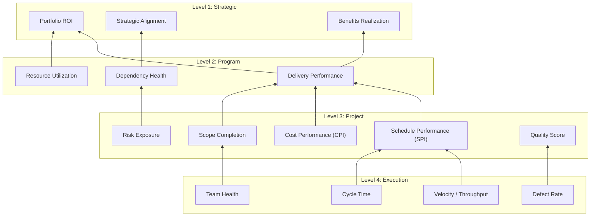

# KPI Mapping Template

**Purpose:** Map project execution metrics to strategic outcomes using a 4-level KPI hierarchy. This template connects daily team activity to organizational value delivery.

> **Related resources:**
> - [KPI Hierarchy Model](../../meta/architecture-research/784-785-kpi-mapping-design.md) — design rationale
> - [Benefits Realization Framework](../../business-stakeholder-suite/financial-governance/benefit-realization-framework.md) — strategic benefits tracking
> - [Project Health Dashboard](../../dashboards/project-health-dashboard.md) — operational monitoring
> - [Product Metrics Dashboard](../../role-based-toolkits/product-owner/product-metrics-dashboard.md) — product-level metrics

---

## How to Use This Template

1. **Start at Level 3 (Project)** — fill in your project's core KPIs
2. **Map downward to Level 4 (Execution)** — identify which team metrics feed each project KPI
3. **Map upward to Levels 2–1 (Program/Strategic)** — connect project KPIs to organizational outcomes
4. **Review monthly** — update actuals, recalibrate targets, adjust leading indicators

---

## Level 1: Strategic KPIs (Executive/Sponsor)

These measure whether projects deliver organizational value. Typically tracked quarterly.

| KPI | Definition | Target | Actual | Trend | Source Template |
|-----|-----------|--------|--------|-------|-----------------|
| Portfolio ROI | Return on investment across all active projects | ≥ ___% | | | [ROI Tracking Dashboard](../../business-stakeholder-suite/financial-governance/roi-tracking-dashboard.md) |
| Strategic Alignment Score | % of projects mapped to strategic objectives | ≥ ___% | | | [Executive Dashboard](../../business-stakeholder-suite/executive-dashboards/powerbi-integration/executive-dashboard-template.md) |
| Benefits Realization Rate | % of planned benefits actually delivered | ≥ ___% | | | [Benefits Realization Framework](../../business-stakeholder-suite/financial-governance/benefit-realization-framework.md) |
| Organizational Capability Maturity | Process maturity assessment score | ≥ ___/5 | | | [Process Maturity Assessment](../../project-assessment-suite/process-maturity-assessment-template.md) |

**Leading indicators:** Benefits pipeline value, strategic initiative count, capability investment %

---

## Level 2: Program KPIs (Program Manager)

These measure cross-project health and coordination. Typically tracked monthly.

| KPI | Definition | Target | Actual | Trend | Source Template |
|-----|-----------|--------|--------|-------|-----------------|
| Cross-Project Dependency Health | % of inter-project dependencies on track | ≥ ___% | | | [Program Management Plan](../../templates/traditional/Traditional/Templates/program_management_plan_template.md) |
| Aggregate Resource Utilization | Avg utilization across project teams | ___–___% | | | [Resource Management Plan](../../project-lifecycle/02-planning/resource-planning/resource-management-plan-template.md) |
| Aggregate Delivery Performance | % of projects meeting schedule/cost baselines | ≥ ___% | | | [Project Performance Monitoring](../../templates/traditional/Traditional/Process_Groups/Monitoring_and_Controlling/project_performance_monitoring_template.md) |
| Program Benefits On Track | % of program benefits trending to plan | ≥ ___% | | | [Benefits Realization Framework](../../business-stakeholder-suite/financial-governance/benefit-realization-framework.md) |

**Leading indicators:** Dependency risk count, resource conflict rate, milestone slip rate

---

## Level 3: Project KPIs (Project Manager)

These are the core project health metrics. Tracked weekly or bi-weekly.

| KPI | Type | Definition | Target | Actual | Trend | Source Template |
|-----|------|-----------|--------|--------|-------|-----------------|
| Schedule Performance Index (SPI) | Lagging | Earned schedule / planned schedule | ≥ 0.95 | | | [EVM Dashboard](../../business-stakeholder-suite/financial-governance/enhanced-business-cases/evm-dashboard-template.md) |
| Cost Performance Index (CPI) | Lagging | Earned value / actual cost | ≥ 0.95 | | | [Budget Dashboard](../../business-stakeholder-suite/financial-governance/budget-dashboard-template.md) |
| Scope Completion % | Lagging | Deliverables accepted / total deliverables | ≥ ___% | | | [Status Report](../../project-lifecycle/04-monitoring-control/progress-tracking/status-report-template.md) |
| Risk Exposure Trend | Leading | Total risk score change over time | Decreasing | | | [Risk Register](../../project-lifecycle/02-planning/risk-management/risk-register-template.md) |
| Stakeholder Satisfaction | Lagging | Stakeholder survey score | ≥ ___/5 | | | [Stakeholder Engagement Assessment](../../project-assessment-suite/stakeholder-engagement-assessment-template.md) |
| Quality Score | Lagging | Defects per deliverable / rework rate | ≤ ___% | | | [Quality Test Plan](../../templates/test-samples/quality-test-plan-template.md) |

**Leading indicators:** Open risk count, issue resolution rate, change request volume

---

## Level 4: Execution Metrics (Team)

These are day-to-day operational metrics. Tracked per sprint or weekly.

### Agile Teams

| Metric | Type | Definition | Target | Actual | Trend |
|--------|------|-----------|--------|--------|-------|
| Sprint Velocity | Lagging | Story points completed per sprint | ___ pts | | |
| Cycle Time | Leading | Avg days from "in progress" to "done" | ≤ ___ days | | |
| Sprint Goal Achievement | Lagging | % of sprint goals fully met | ≥ ___% | | |
| Burndown Accuracy | Leading | Actual vs. ideal burndown variance | ≤ ___% | | |
| WIP Limit Adherence | Leading | % of time WIP stays within limits | ≥ ___% | | |
| Defect Escape Rate | Lagging | Defects found post-sprint / total items | ≤ ___% | | |

### Traditional Teams

| Metric | Type | Definition | Target | Actual | Trend |
|--------|------|-----------|--------|--------|-------|
| Milestone Completion Rate | Lagging | Milestones hit on time / total milestones | ≥ ___% | | |
| Deliverable Acceptance Rate | Lagging | Deliverables accepted first time / total | ≥ ___% | | |
| Issue Resolution Time | Leading | Avg days to resolve issues | ≤ ___ days | | |
| Change Request Rate | Leading | Change requests per month | ≤ ___ /month | | |
| Rework Rate | Lagging | Hours rework / total hours | ≤ ___% | | |

### Team Health (All Methodologies)

| Dimension | Score (1–5) | Notes |
|-----------|-------------|-------|
| Team morale | | |
| Workload balance | | |
| Psychological safety | | |
| Collaboration quality | | |
| Learning & growth | | |
| **Team Health Score** | **___/25** | |

---

## KPI Flow Map

This diagram shows how execution metrics feed into project KPIs, which aggregate to program and strategic levels.

---

## Pre-Mapped KPI Examples

### Example 1: Small Agile IT Project
| Level | KPIs to Track | Frequency |
|-------|--------------|-----------|
| Strategic | Strategic Alignment Score | Quarterly |
| Project | SPI, Scope Completion, Quality Score | Bi-weekly |
| Execution | Velocity, Cycle Time, Sprint Goal Achievement | Per sprint |

### Example 2: Large Traditional Regulated Program
| Level | KPIs to Track | Frequency |
|-------|--------------|-----------|
| Strategic | Portfolio ROI, Benefits Realization Rate | Quarterly |
| Program | Delivery Performance, Dependency Health, Resource Utilization | Monthly |
| Project | SPI, CPI, Risk Exposure, Stakeholder Satisfaction | Bi-weekly |
| Execution | Milestone Completion, Issue Resolution Time, Change Request Rate | Weekly |

### Example 3: Medium Hybrid Financial Project
| Level | KPIs to Track | Frequency |
|-------|--------------|-----------|
| Strategic | ROI, Benefits Realization | Quarterly |
| Project | SPI, CPI, Scope Completion, Risk Exposure | Bi-weekly |
| Execution | Velocity (agile streams), Milestone Completion (traditional streams), Team Health | Weekly |

---

## Review Cadence

| Review Type | Frequency | KPI Levels Covered | Audience |
|-------------|-----------|-------------------|----------|
| Daily standup | Daily | Level 4 (blockers only) | Team |
| Sprint review | Per sprint | Levels 3–4 | Team + stakeholders |
| Monthly project review | Monthly | Levels 2–3 | PM + program manager |
| Quarterly business review | Quarterly | Levels 1–2 | Executives + sponsors |
